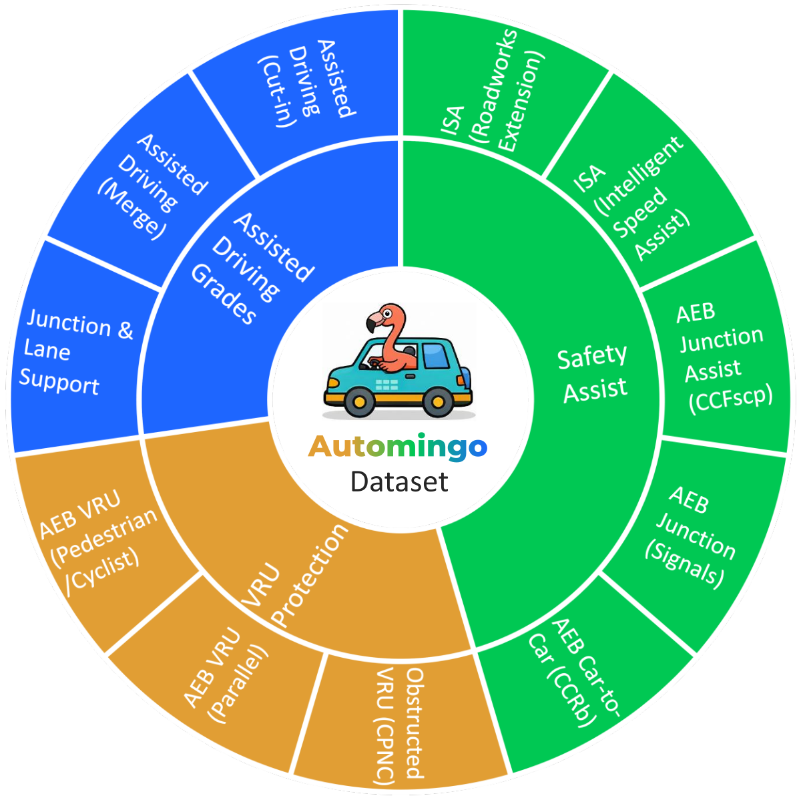
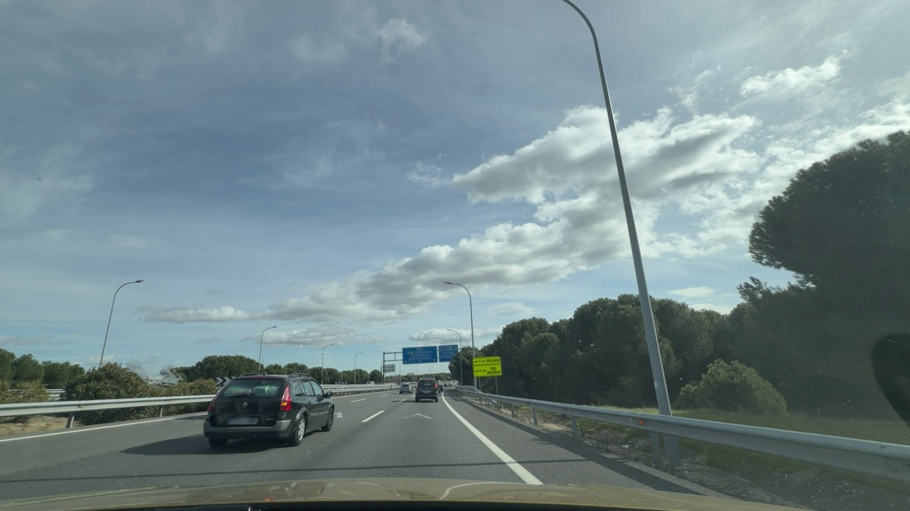
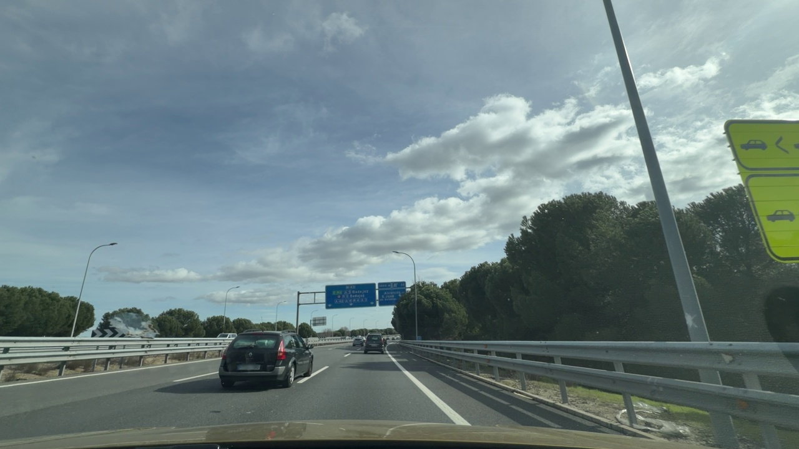
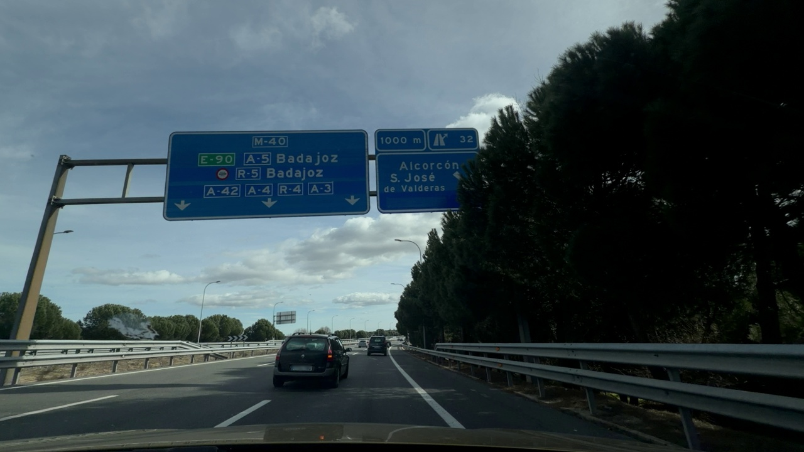
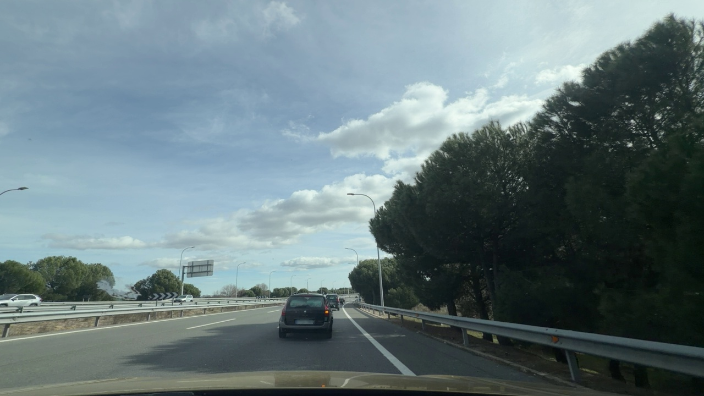
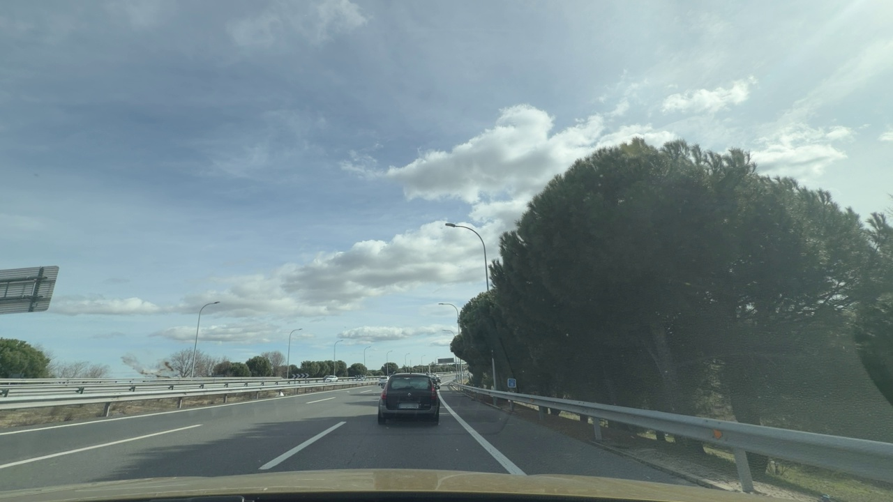

# Automingo: Seeing the Unseen

[CVPRW] Official GitHub repository for "Automingo: road to anywhere", TBD

[[paper preprint]]()[[paper arxiv]]()

[[Dataset huggingface]](https://huggingface.co/VendaDi/Qwen3-VL-8B-Instruct-Automingo) [[Model huggingface]](https://huggingface.co/VendaDi/Qwen3-VL-8B-Instruct-Automingo)

<p align="center">
  
</p>

Automingo is a repository for **safety-critical driving VQA and VLM fine-tuning**. It focuses on structured scene understanding for ADAS-style reasoning rather than generic open-ended driving captions. The project includes training, evaluation, scoring, and sweep scripts used for the **Automingo-VQA** benchmark and the fine-tuned **Automingo-VLM-8B** model.

## What is in this repo

- fine-tuning code for Qwen-based vision-language models
- evaluation scripts for multiple VLMs
- sweep utilities for hyperparameter search
- result files from training runs
- helper utilities for prompt formatting, judging, and metrics

## Repository layout

```text
.
├── libs/                       # shared project code
├── utils/                      # helper utilities
├── results_qwen3vl/            # saved evaluation outputs / sweep results
├── finetune.py                 # supervised fine-tuning entrypoint
├── finetune_sweep.py           # sweep launcher
├── evaluate.py                 # benchmark/evaluation script
├── calculate_accuracy.py       # post-processing / metrics
├── models.py                   # model loading helpers
├── evaluation_settings.yaml    # evaluation config
├── evaluation_settings_checkpoint.yaml
├── system_prompt.txt           # prompting template
└── requirements.txt
```

## Dataset and task

<p align="center">
  
</p>

Automingo-VQA is built for **structured analysis of safety-critical driving situations** such as:

- cut-ins
- traffic light transitions
- vulnerable road user interactions
- leading braking conflicts
- construction and lane-shift situations
- intersections and roundabouts

The dataset uses **5-frame temporal snippets** around an analyst-defined event anchor and pairs them with scenario-centric questions, answers, and reasoning. In the current paper version, the dataset contains:

- **6,565 images**
- **1,313 events**
- **5,792 QA pairs**

## Example Scene (Automingo-VQA)

| t−3.0 | t−1.5 | **t₀** | t+1.5 | t+3.0 |
|------|------|--------|------|------|
|  |  |  |  |  |

---

**Question:**  
Is the ego lane narrowed or laterally shifted due to construction elements?

**Answer:**  
No

**Reasoning:**  
The ego lane is not narrowed at any point, just a normal urban road.

---

*Example of one of the Euro-NCAP scenes and related question of lateral parking within our Automingo-VQA dataset. The highlighted frame (t₀) corresponds to the analyst-annotated event anchor, from which the remaining frames are extracted at scenario-specific temporal offsets.*

## Installation

```bash
git clone https://github.com/VincieD/Automingo-Seeing-the-Unseen.git
cd Automingo-Seeing-the-Unseen
pip install -r requirements.txt
```

Set the required API keys only if you use external model providers during evaluation:

```bash
export OPENAI_API_KEY="YOUR_OPENAI_API_KEY"
export GOOGLE_API_KEY="YOUR_GOOGLE_API_KEY"
export ANTHROPIC_API_KEY="YOUR_ANTHROPIC_API_KEY"
export HF_TOKEN="YOUR_HF_TOKEN"
```

## Access to models

Some evaluated models may require separate gated access on Hugging Face or provider-side credentials. Check access before running large evaluations. For example:
- google/paligemma2-3b-mix-448 is restricted. You must have access to it and be authenticated to access it. Please log in.
- meta-llama/Llama-3.2-11B-Vision-Instruct is restricted. You must have access to it and be authenticated to access it. Please log in.
- openbmb/MiniCPM-V-2_6 is restricted. You must have access to it and be authenticated to access it. Please log in.

## Fine-tuning

Run a standard fine-tuning job with:

```bash
python finetune.py
```

Run a W&B sweep with:

```bash
python finetune_sweep.py --sweep --project qwen3vl-sft
wandb agent user/qwen3vl-sft/57qxprkb
```

The paper reports LoRA-based supervised fine-tuning of **Qwen3-VL-8B-Instruct**, adapting:

```text
q_proj, k_proj, v_proj, o_proj, up_proj, down_proj, gate_proj
```

Best reported setup:

- learning rate: `2e-4`
- LoRA rank: `32`
- gradient accumulation: `8`
- optimizer: `AdamW`

## Evaluation

Main evaluation entrypoint:

```bash
python evaluate.py --config evaluation_settings.yaml
```

Post-process and compute accuracy with:

```bash
python calculate_accuracy.py
```

The benchmark reports:

- **MCQ accuracy**
- **invalid attempts**
- **semantic score** with **Lingo-Judge**

## Main results

| Model | MCQ Acc. (%) | Invalid Attempts | Lingo-Judge |
|---|---:|---:|---:|
| GPT-5.2 | 83.4 | 1 | **0.640** |
| Gemini-3.1-Flash | 83.5 | 0 | 0.595 |
| Claude-4-Sonnet | 86.0 | 40 | 0.546 |
| Qwen3-VL-8B | 81.5 | 9 | 0.556 |
| InternVL3.5-8B | 80.9 | 233 | 0.534 |
| Qwen2.5-VL-7B | 74.6 | 0 | 0.539 |
| Idefics3-8B | 70.5 | 0 | 0.417 |
| LLaVA-1.5-7B | 62.9 | 2 | 0.363 |
| **Automingo-VLM-8B** | **89.3** | 43 | 0.628 |

Automingo-VLM-8B improves over the base Qwen3-VL-8B model and achieves the best overall MCQ accuracy in the benchmark.

## Notes

- the repository is centered on **code and experiments**, not only on dataset release
- the benchmark is designed for **regulation-aware / ADAS-oriented reasoning**
- challenging scenarios remain **roundabouts** and **intersections**, while the fine-tuned model is especially strong on **cut-in** situations

## Links

- Dataset: [ibarcelo/Automingo_dataset](https://huggingface.co/datasets/ibarcelo/Automingo_dataset)
- Lingo-Judge: [wayveai/Lingo-Judge](https://huggingface.co/wayveai/Lingo-Judge)

## Citation

```bibtex
@inproceedings{Divis_2026_CVPR,
  title     = {Automingo: Seeing the Unseen - Vision-Language Edge Case Dataset for Detection and Analysis of Autonomous Driving},
  author    = {Diviš, Václav and Barceló Álvarez, Íñigo and Fariñas Nubla, Alejandro and Sánchez, Enrique and Hernández-Ros Briales, Antonio and Valach, Ondřej and Gruber, Ivan and Hruž, Marek},
  booktitle = {Proceedings of the IEEE/CVF Conference on Computer Vision and Pattern Recognition (CVPR) Workshops},
  month     = {June},
  year      = {2026},
  pages     = {665-674}
}
```
